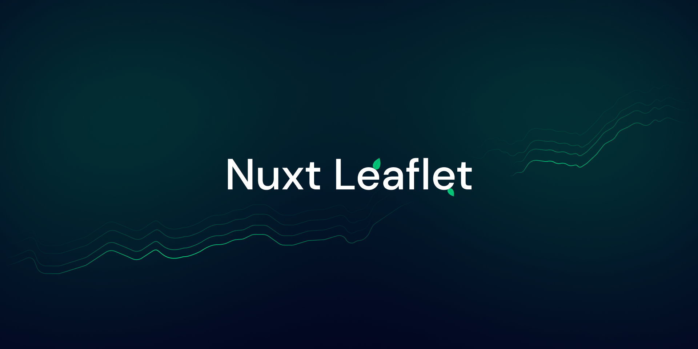

[](https://leaflet.nuxtjs.org)

# Nuxt Leaflet

[![npm version][npm-version-src]][npm-version-href]
[![npm downloads][npm-downloads-src]][npm-downloads-href]
[![License][license-src]][license-href]
[![Nuxt][nuxt-src]][nuxt-href]

A Nuxt module to use Leaflet.
It was made using [Vue Leaflet](https://github.com/vue-leaflet/vue-leaflet) which is a Vue 3 wrapper for Leaflet, that exposes the original Leaflet API as Vue components.

This module is really just about making it work with Nuxt without the need to configure anything.

- [✨ &nbsp;Release Notes](/CHANGELOG.md)
<!-- - [🏀 Online playground](https://stackblitz.com/github/nuxtjs/leaflet?file=playground%2Fapp.vue) -->
- [📖 &nbsp;Documentation](https://leaflet.nuxtjs.org)

## Features

- ⚡ &nbsp;No configuration needed
- 🦺 &nbsp;Typescript support
- 🚠 &nbsp;Auto import

## Quick Setup

```bash
npx nuxi@latest module add @nuxtjs/leaflet
```

That's it! You can now use Leaflet in your Nuxt app ✨

## Usage

For a complete list of the components available, check out the [official documentation](https://leaflet.nuxtjs.org/components/introduction.html) library.

### Basic

```vue
<template>
  <div style="height:100vh; width:100vw">
    <LMap
      ref="map"
      :zoom="zoom"
      :center="[47.21322, -1.559482]"
      :use-global-leaflet="false"
    >
      <LTileLayer
        url="https://{s}.tile.openstreetmap.org/{z}/{x}/{y}.png"
        attribution="&amp;copy; <a href=&quot;https://www.openstreetmap.org/&quot;>OpenStreetMap</a> contributors"
        layer-type="base"
        name="OpenStreetMap"
      />
    </LMap>
  </div>
</template>

<script setup>
import { ref } from 'vue'
const zoom = ref(6)
</script>
```

## Development

```bash
# Install dependencies
npm install

# Generate type stubs
npm run dev:prepare

# Develop with the playground
npm run dev

# Build the playground
npm run dev:build

# Run ESLint
npm run lint

# Run Vitest
npm run test
npm run test:watch

# Release new version
npm run release
```

<!-- Badges -->
[npm-version-src]: https://img.shields.io/npm/v/@nuxtjs/leaflet/latest.svg?style=flat&colorA=18181B&colorB=28CF8D
[npm-version-href]: https://www.npmjs.com/package/@nuxtjs/leaflet

[npm-downloads-src]: https://img.shields.io/npm/dm/@nuxtjs/leaflet.svg?style=flat&colorA=18181B&colorB=28CF8D
[npm-downloads-href]: https://www.npmjs.com/package/@nuxtjs/leaflet

[license-src]: https://img.shields.io/npm/l/@nuxtjs/leaflet.svg?style=flat&colorA=18181B&colorB=28CF8D
[license-href]: https://www.npmjs.com/package/@nuxtjs/leaflet

[nuxt-src]: https://img.shields.io/badge/Nuxt-18181B?logo=nuxt.js
[nuxt-href]: https://nuxt.com
